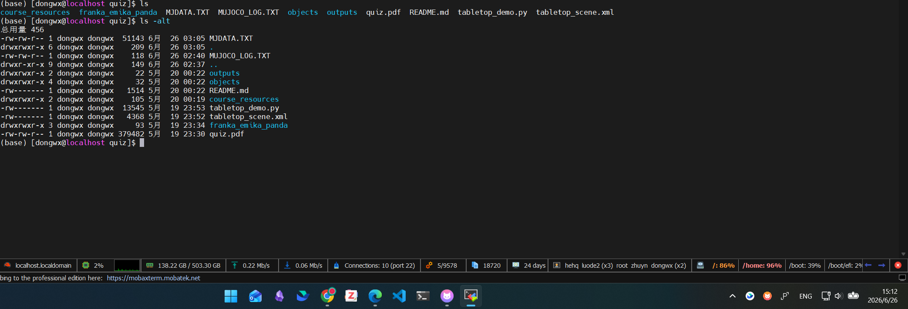

# CS2810 Quiz Regrade Evidence

The original submitted video accidentally showed the default scripted pick-and-place demo. The submitted implementation already included the two interactive controls required by the quiz:

- **Manual mocap control:** `python tabletop_demo.py --manual` reads the MuJoCo viewer mocap target pose every frame and drives the Franka hand with IK.
- **Keyboard gripper callback:** `+` / `=` closes the gripper, and `-` / `_` opens it through the viewer key callback.
- **Pre-deadline source evidence:** the archived source package preserves the original file timestamps, and the screenshot below shows the key files were last modified before the quiz deadline.

## Supplemental Video

[Watch or download the manual-control demonstration video](assets/cs2810_quiz_pick_speed2x_0626_540p8.mp4)

<video src="assets/cs2810_quiz_pick_speed2x_0626_540p8.mp4" controls width="900"></video>

## Timestamp Evidence

## Source Evidence Package

[Download the archived submitted implementation](cs2810_quiz_regrade_evidence_20260626.zip)
